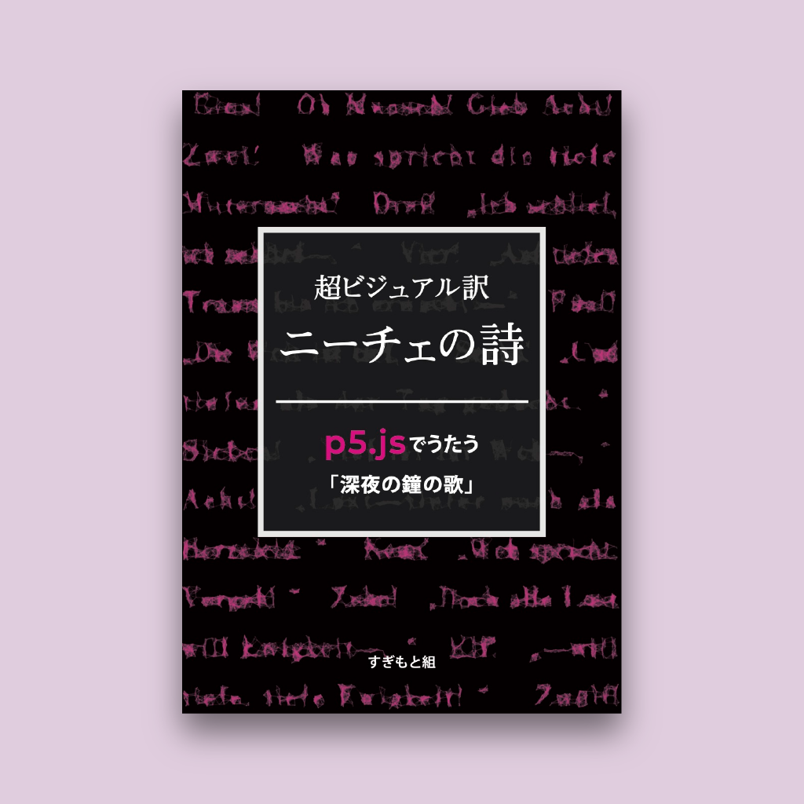

### 超ビジュアル訳　ニーチェの詩：p5.jsでうたう「深夜の鐘の歌」
### サポートサイト

技術書典9で頒布しています。  
[超ビジュアル訳　ニーチェの詩：p5.jsでうたう「深夜の鐘の歌」：すぎもと組](https://techbookfest.org/product/5727504515989504)

サークルページはこちら。  
[すぎもと組 | 技術書典](https://techbookfest.org/organization/5752355920281600)

### ソースコード

p5.js Web Editorのスケッチページにリンクしています。

#### 深夜の鐘の歌

- [深夜の鐘の歌](https://editor.p5js.org/sugi2000/sketches/RForLc1Xn)
- [ひとつ！](https://editor.p5js.org/hitomi/sketches/Nc7dniCvD)
- [ふたつ！](https://editor.p5js.org/kom-shin/sketches/OlS2LZPJB)
- [みっつ！](https://editor.p5js.org/hitomi/sketches/__IxSm3ez)
- [よっつ！](https://editor.p5js.org/TS5632/sketches/ord5dODu8)
- [いつつ！](https://editor.p5js.org/Sumikko-Mountain/sketches/h7iLrCbo6)
- [むっつ！](https://editor.p5js.org/kom-shin/sketches/WmvESYa-m)
- [ななつ！](https://editor.p5js.org/TS5632/sketches/7JuG8PYv_)
- [やっつ！](https://editor.p5js.org/kom-shin/sketches/19xmyznU6)
- [ここのつ！](https://editor.p5js.org/Sumikko-Mountain/sketches/BtZ5mCxK0)
- [とお！](https://editor.p5js.org/hitomi/sketches/F-xdzFiZ8)
- [じゅういち！](https://editor.p5js.org/Sumikko-Mountain/sketches/p-qzwQhYm)
- じゅうに！

#### 編著者かく語りき

- [シンノスケコマツ](https://editor.p5js.org/kom-shin/sketches/lKKwqZrLe)
- [セキグチタイキ](https://editor.p5js.org/TS5632/sketches/gNdjt8w0X)
- [スヤマトゥストラ](https://editor.p5js.org/Sumikko-Mountain/sketches/zxGjFAhgQ)
- [ヒトミヤザキ](https://editor.p5js.org/hitomi/sketches/qUZJsbQ0N)
- [タトゥオスギ](https://editor.p5js.org/sugi2000/sketches/bfh6-Bgrn)

### 正誤表

誤りが見つかった場合はこちらに掲載します。

### おまけ

技術書典オンラインマーケットの自分の本棚から「購入しました」ツイートをするブックマークレットです。以下のリンクをブックマークに追加してください。

[購入しましたツイート](javascript:'use strict';(function(){if(null===document.querySelector(".MuiDialog-root"))alert("\u672c\u68da\u306e\u672c\u3092\u9078\u629e\u3057\u3066\u304f\u3060\u3055\u3044\u3002");else{var a=document.querySelector(".r-gu0qjt > div:nth-child(2) > div:nth-child(1) > div:nth-child(1) > div:nth-child(1) > a:nth-child(1)");const b=document.querySelector(".r-1enofrn").textContent;a=`https://twitter.com/intent/tweet?text=${encodeURIComponent(`\u6280\u8853\u66f8\u5178\u30aa\u30f3\u30e9\u30a4\u30f3\u30de\u30fc\u30b1\u30c3\u30c8\u3067${b}\u306e\u300c${a.text}\u300d\u3092\u8cfc\u5165\u3057\u307e\u3057\u305f\uff01 #\u6280\u8853\u66f8\u5178%20${a.href}`)}`;%20window.open(a)}})();)
